# 👩‍💻 온라인 강의를 듣고 학습 및 실습한 내용을 정리했습니다

 

 

# Yammer 소개

- 사내 커뮤니케이션, 협업 등을 할 수 있는 기업용 sns 서비스(Slack과 유사)

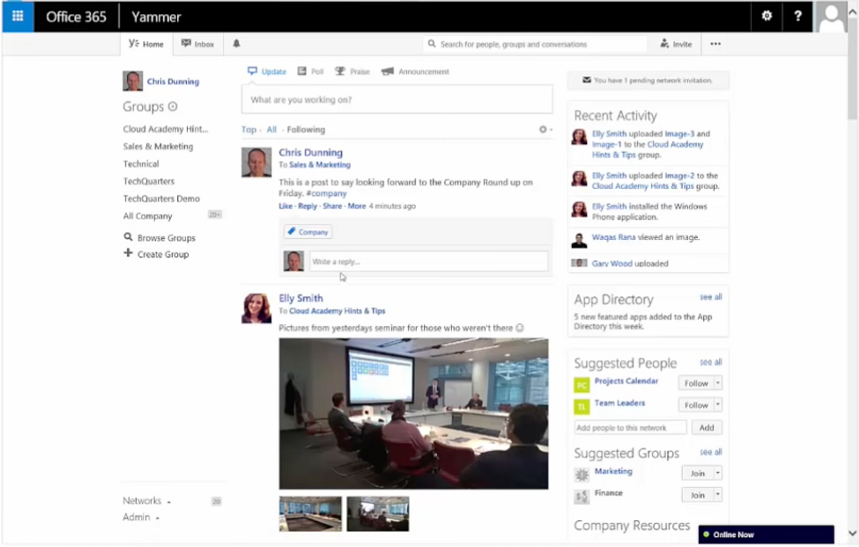</img>

 

 

# 1. Yammer 유저 인게이지먼트 하락 원인 분석

### [문제 상황]

### 2014-08-04 주에 WAU가 12.21% 감소

(Active User: 로그인 한 유저)

```sql
SELECT DATE_TRUNC('week', e.occurred_at) AS week,
       COUNT(DISTINCT e.user_id) AS weekly_activate_users
  FROM tutorial.yammer_events e
  WHERE e.event_type = 'engagement'
        AND e.event_name = 'login'
  GROUP BY 1
  ORDER BY 1;
```

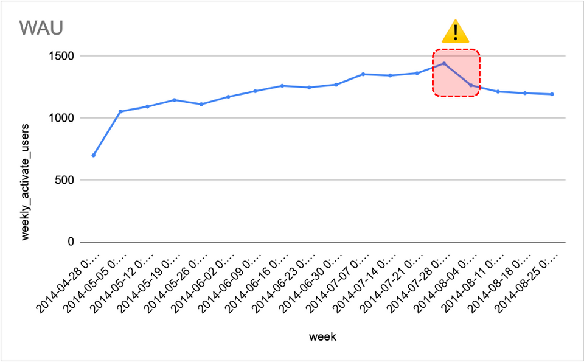</img>

 

 

### (1) 신규가입자가 감소했나?

신규가입자는 가입 후 반드시 로그인을 하므로 WAU에 영향을 끼칠 수 있음

(신규가입자: 최근 3개월 이내 가입자)

### ⇒ 8/4 주에 신규가입자 감소. 이후 이전 수준으로 회복하며 소폭 증가

```sql
SELECT DATE_TRUNC('week', u.created_at) AS week,
       COUNT(u.user_id) AS all_new_users,
       COUNT(CASE WHEN activated_at IS NOT NULL THEN u.user_id ELSE NULL END) AS activated_new_users
  FROM tutorial.yammer_users u
  WHERE u.created_at BETWEEN '2014-06-01 00:00:00' AND '2014-08-31 23:59:59'
  GROUP BY 1
  ORDER BY 1;
```

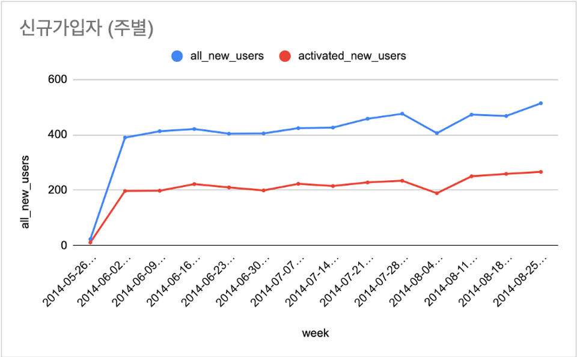</img>

 

 

### (2) 코호트 분석을 해보자

- 유저를 가입주별로 나누어 분석

### ⇒ 8/4 주에 10+ week 유저의 로그인 횟수가 급감하는 경향이 있음

```sql
SELECT DATE_TRUNC('week', z.login_date) AS "week",
       COUNT(DISTINCT CASE WHEN z.user_age >=70 THEN z.user_id ELSE NULL END) AS "10+ week",
       COUNT(DISTINCT CASE WHEN z.user_age >=63 AND z.user_age < 70 THEN z.user_id ELSE NULL END) AS "9 week",
       COUNT(DISTINCT CASE WHEN z.user_age >=56 AND z.user_age < 63 THEN z.user_id ELSE NULL END) AS "8 week",
       COUNT(DISTINCT CASE WHEN z.user_age >=49 AND z.user_age < 56 THEN z.user_id ELSE NULL END) AS "7 week",
       COUNT(DISTINCT CASE WHEN z.user_age >=42 AND z.user_age < 49 THEN z.user_id ELSE NULL END) AS "6 week",
       COUNT(DISTINCT CASE WHEN z.user_age >=35 AND z.user_age < 42 THEN z.user_id ELSE NULL END) AS "5 week",
       COUNT(DISTINCT CASE WHEN z.user_age >=28 AND z.user_age < 35 THEN z.user_id ELSE NULL END) AS "4 week",
       COUNT(DISTINCT CASE WHEN z.user_age >=21 AND z.user_age < 28 THEN z.user_id ELSE NULL END) AS "3 week",
       COUNT(DISTINCT CASE WHEN z.user_age >=14 AND z.user_age < 21 THEN z.user_id ELSE NULL END) AS "2 week",
       COUNT(DISTINCT CASE WHEN z.user_age >=7 AND z.user_age < 14 THEN z.user_id ELSE NULL END) AS "1 week",
       COUNT(DISTINCT CASE WHEN z.user_age < 7 THEN z.user_id ELSE NULL END) AS "Less than a week"
  FROM(
       SELECT u.user_id,
              EXTRACT(day FROM '2014-09-01' - u.activated_at) AS user_age,
              e.occurred_at AS login_date
         FROM tutorial.yammer_users u
         JOIN tutorial.yammer_events e
              ON u.user_id = e.user_id
         WHERE u.activated_at IS NOT NULL
               AND e.event_type = 'engagement'
               AND e.event_name = 'login'
      ) z
  GROUP BY 1
  ORDER BY 1;
```

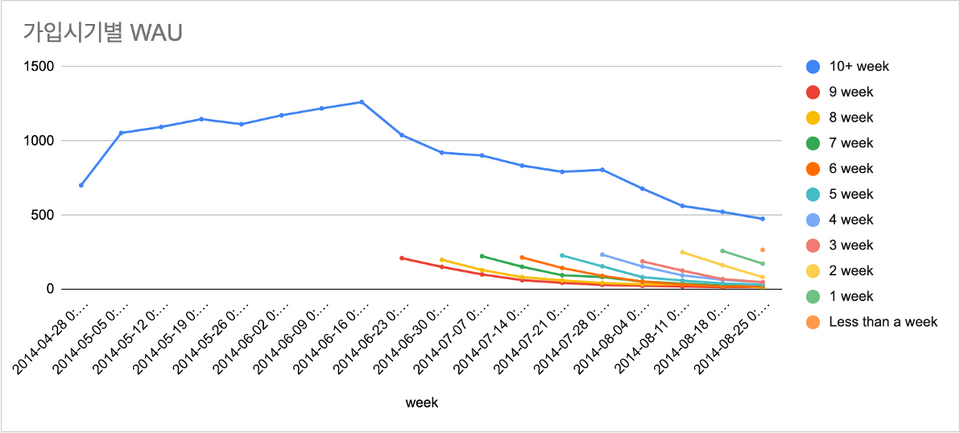</img>

 

- 사용 디바이스별로 나누어 분석

### ⇒ 8/4 주에 모바일 기기 유저(phone, tablet)의 로그인 횟수가 급감

```sql
SELECT DATE_TRUNC('week', occurred_at) AS week,
       COUNT(DISTINCT CASE WHEN e.device IN ('macbook pro','lenovo thinkpad','macbook air','dell inspiron notebook',
          'asus chromebook','dell inspiron desktop','acer aspire notebook','hp pavilion desktop','acer aspire desktop','mac mini')
          THEN e.user_id ELSE NULL END) AS computer,
       COUNT(DISTINCT CASE WHEN e.device IN ('iphone 5','samsung galaxy s4','nexus 5','iphone 5s','iphone 4s','nokia lumia 635',
       'htc one','samsung galaxy note','amazon fire phone') THEN e.user_id ELSE NULL END) AS phone,
        COUNT(DISTINCT CASE WHEN e.device IN ('ipad air','nexus 7','ipad mini','nexus 10','kindle fire','windows surface',
        'samsumg galaxy tablet') THEN e.user_id ELSE NULL END) AS tablet
  FROM tutorial.yammer_events e
 WHERE e.event_type = 'engagement'
       AND e.event_name = 'login'
  GROUP BY 1
  ORDER BY 1;
```

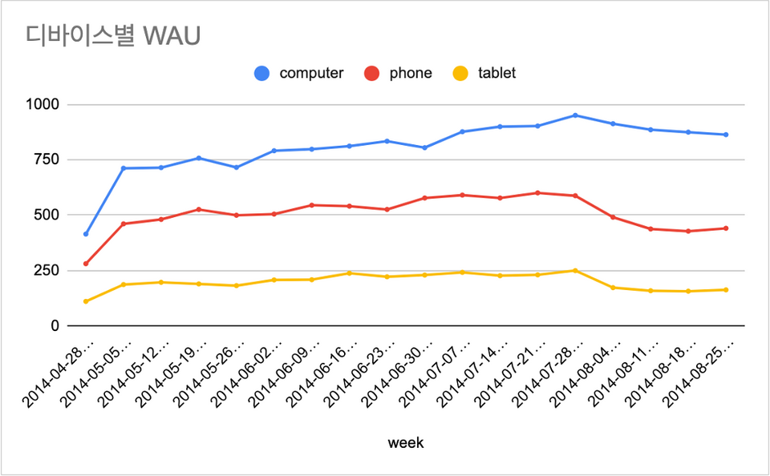</img>

 

 

### (4) 이메일 데이터를 확인해보자

- 유저의 로그인을 유도하는 reengagement email 관련 데이터 확인

### ⇒ 8/4 주에 이메일 내의 로그인 링크를 클릭하는 횟수가 급감

```sql
SELECT DATE_TRUNC('week', occurred_at) AS week,
       COUNT(DISTINCT CASE WHEN action = 'sent_weekly_digest' THEN user_id ELSE NULL END) AS weekly_emails,
       COUNT(DISTINCT CASE WHEN action = 'sent_reengagement_email' THEN user_id ELSE NULL END) AS reengagement_email,
       COUNT(DISTINCT CASE WHEN action = 'email_open' THEN user_id ELSE NULL END) AS email_opens,
       COUNT(DISTINCT CASE WHEN action = 'email_clickthrough' THEN user_id ELSE NULL END) AS email_clickthroughs
  FROM tutorial.yammer_emails
  GROUP BY 1
  ORDER BY 1;
```

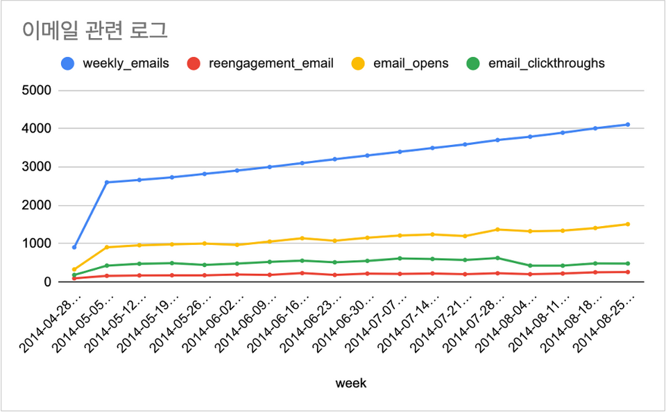</img>

 

- 이메일 수신 5분 내로 이메일을 오픈하거나 링크를 클릭하는 비율 확인

### ⇒ 8/4 주에 digest email 내의 로그인 링크를 클릭하는 횟수가 급감

```sql
SELECT DATE_TRUNC('week', e1.occurred_at) AS week, -- 이메일 보낸 주
       COUNT(CASE WHEN e1.action = 'sent_weekly_digest' THEN e1.user_id ELSE NULL END) AS digest_email,
       COUNT(CASE WHEN e1.action = 'sent_weekly_digest' THEN e2.user_id ELSE NULL END) AS digest_email_open,
       COUNT(CASE WHEN e1.action = 'sent_weekly_digest' THEN e3.user_id ELSE NULL END) AS digest_email_click,
       COUNT(CASE WHEN e1.action = 'sent_reengagement_email' THEN e1.user_id ELSE NULL END) AS reengagement_email,
       COUNT(CASE WHEN e1.action = 'sent_reengagement_email' THEN e2.user_id ELSE NULL END) AS reengagement_email_open,
       COUNT(CASE WHEN e1.action = 'sent_reengagement_email' THEN e3.user_id ELSE NULL END) AS eengagement_email_click
  FROM tutorial.yammer_emails e1
  LEFT JOIN tutorial.yammer_emails e2
            ON e2.user_id = e1.user_id
               AND e2.action = 'email_open'
               AND e2.occurred_at BETWEEN e1.occurred_at AND ADDDATE(e1.occurred_at, INTERVAL 5 MINUTE)
  LEFT JOIN tutorial.yammer_emails e3
            ON e3.user_id = e1.user_id
               AND e3.action = 'email_clickthrough'
               AND e3.occurred_at BETWEEN e1.occurred_at AND ADDDATE(e1.occurred_at, INTERVAL 5 MINUTE)
  WHERE e1.occurred_at BETWEEN '2014-06-01' AND '2014-09-01'
        AND e1.action IN ('sent_weekly_digest', 'sent_reengagement_email')
  GROUP BY 1;
```

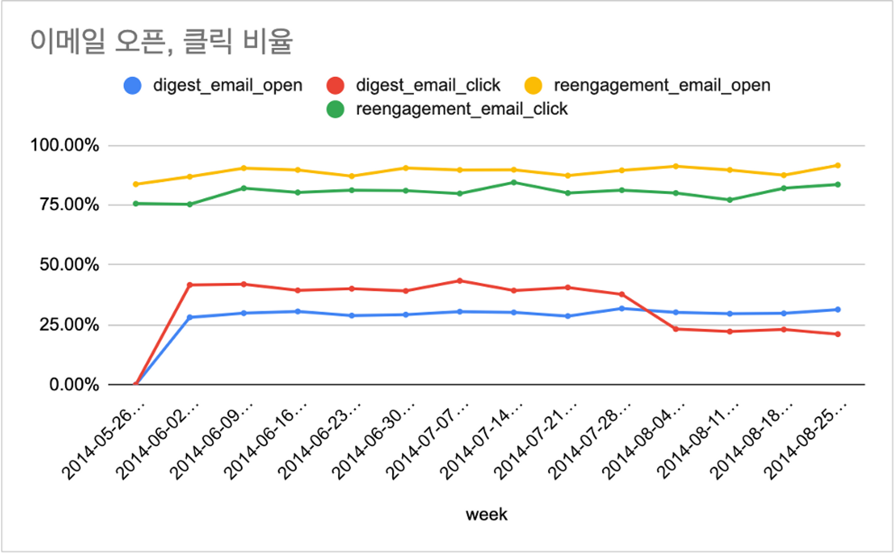</img>

 

# 💡 분석 결과

### 로그인 횟수 감소와 관련이 있는 모바일 앱 & 이메일 내 링크와 관련된 문제 파악 필요

 

 

 

# 2. Yammer publisher 기능 A/B 테스트 유효성 분석

### [문제 상황] 실험 설계 및 지표 해석에 문제가 없었는지 확인

6/1 ~ 6/30 한 달간 publisher 기능에 대한 A/B Test 진행

그룹별로 publisher의 old/new 버전을 각각 노출

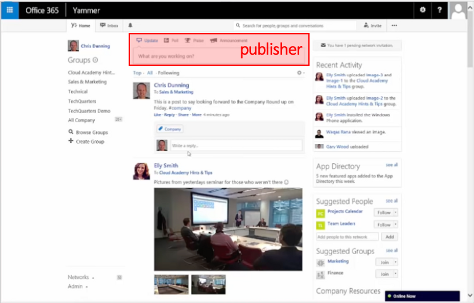</img>
 

살험 결과 test group의 메세지 포스팅 횟수가 1.5배 높음

```sql
SELECT cbu.experiment_group,
       COUNT(cbu.user_id) AS user,
       SUM(cbu.cnt_send_message) AS total,
       AVG(cbu.cnt_send_message) AS average
  FROM (
        SELECT u.user_id,
               ex.experiment_group,
               COUNT(e.user_id) AS cnt_send_message
          FROM tutorial.yammer_experiments ex
          INNER JOIN tutorial.yammer_users u
                     ON ex.user_id = u.user_id
          LEFT JOIN tutorial.yammer_events e
                    ON ex.user_id = e.user_id
                       AND e.occurred_at BETWEEN ex.occurred_at AND '2014-06-30 23:59:59'
                       AND e.event_name = 'send_message'
          WHERE experiment = 'publisher_update'
          GROUP BY 1, 2
          ) cbu -- cnt by user
  GROUP BY 1;
```

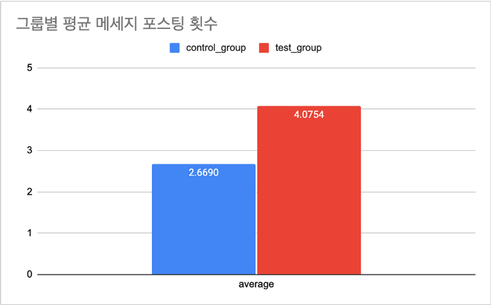</img>

 

 

### (1) 그룹간 차이가 통계적으로 유의미한지 확인

[독립 2표본 t검정(양측꼬리) 실행]

- T-stat = -7.6245

- p-value = 0.0000

### ⇒ 각 그룹간 평균의 차이가 통계적으로 유의미함

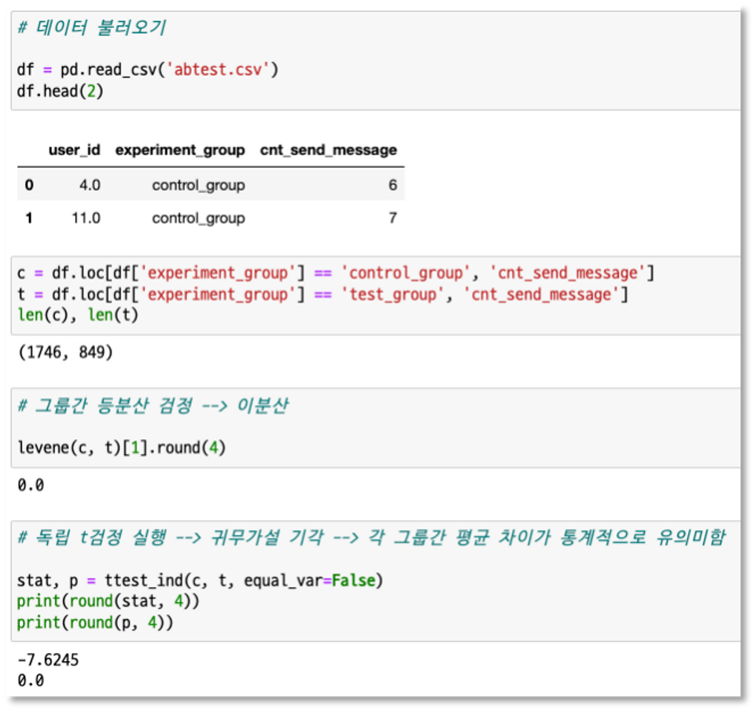</img>

 

 

### (2) 메세지 포스팅 횟수가 테스트의 성공 여부를 잘 반영하는 지표인가?

다른 지표도 추가로 확인해보자 - 로그인 횟수 비교

### ⇒ 그룹별 평균 로그인 횟수와 빈도(days) 모두 test group이 높음

```sql
SELECT cbu.experiment_group,
       COUNT(cbu.user_id) AS user,
       SUM(cbu.cnt_login) AS total,
       AVG(cbu.cnt_login) AS average
  FROM (
        SELECT u.user_id,
               ex.experiment_group,
               COUNT(e.user_id) AS cnt_login
          FROM tutorial.yammer_experiments ex
          INNER JOIN tutorial.yammer_users u
                     ON ex.user_id = u.user_id
          LEFT JOIN tutorial.yammer_events e
                    ON ex.user_id = e.user_id
                       AND e.occurred_at BETWEEN ex.occurred_at AND '2014-06-30 23:59:59'
                       AND e.event_name = 'login'
          WHERE experiment = 'publisher_update'
          GROUP BY 1, 2
          ) cbu -- cnt by user
  GROUP BY 1;
```

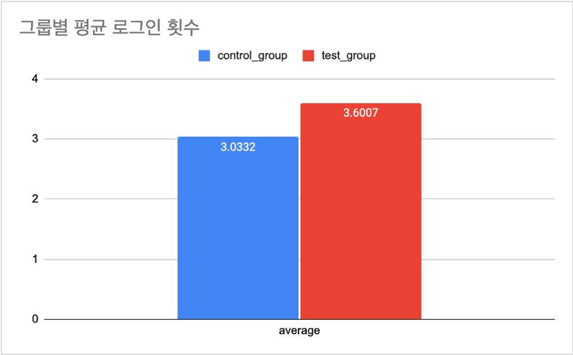</img>

 

```sql
SELECT cbu.experiment_group,
       COUNT(cbu.user_id) AS user,
       SUM(cbu.cnt_login) AS total,
       AVG(cbu.cnt_login) AS average
  FROM(
      SELECT u.user_id,
             ex.experiment_group,
             COUNT(DISTINCT DATE_TRUNC('day', e.occurred_at)) AS cnt_login
        FROM tutorial.yammer_experiments ex
        INNER JOIN tutorial.yammer_users u
                   ON ex.user_id = u.user_id
        LEFT JOIN tutorial.yammer_events e
                  ON ex.user_id = e.user_id
                     AND e.occurred_at BETWEEN ex.occurred_at AND '2014-06-30 23:59:59'
                     AND e.event_name = 'login'
        WHERE experiment = 'publisher_update'
        GROUP BY 1, 2
        ) cbu -- cnt by user
  GROUP BY 1;
```

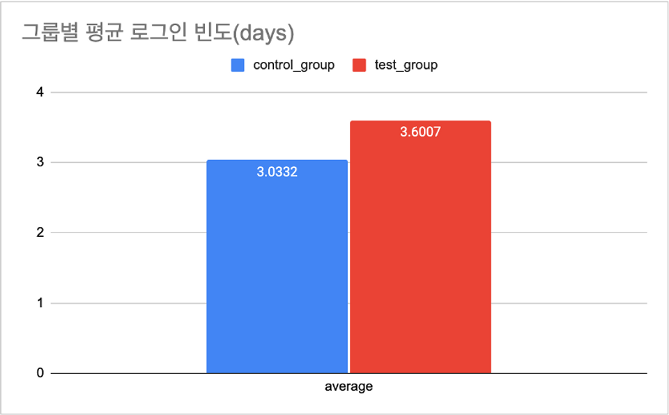</img>

 

 

### (3) 샘플링이 랜덤하게 잘 이루어졌는가?

### ⇒ 6월에 신규 가입한 유저가 모두 control group에 배정되는 오류

```sql
SELECT DATE_TRUNC('month', u.activated_at) AS month,
       COUNT(CASE WHEN ex.experiment_group = 'control_group' THEN u.user_id ELSE NULL END) AS control_group,
       COUNT(CASE WHEN ex.experiment_group = 'test_group' THEN u.user_id ELSE NULL END) AS test_group
  FROM tutorial.yammer_experiments ex
  INNER JOIN tutorial.yammer_users u
             ON ex.user_id = u.user_id
  GROUP BY 1
  ORDER BY 1;
```

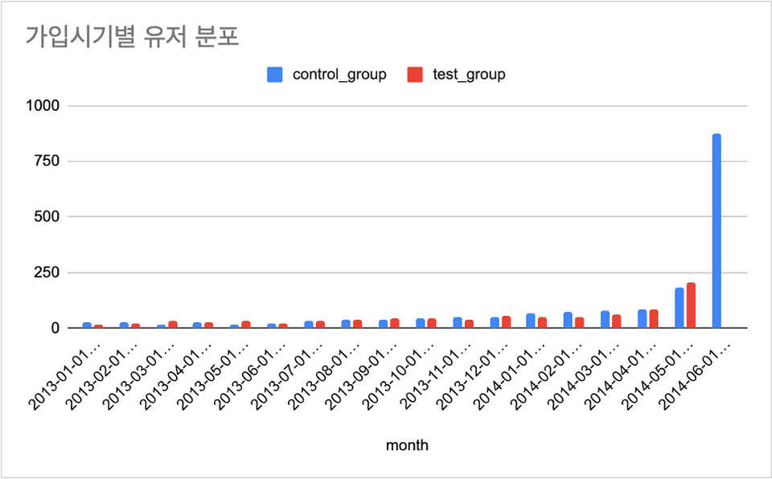</img>

 

 

### (4) 6월 신규가입자를 제외하고 다시 분석해보자

### ⇒ 그래도 test group의 메세지 포스팅 횟수가 1.4배 높으며 통계적으로도 유의미함

```sql
SELECT cbu.experiment_group,
       COUNT(cbu.user_id) AS user,
       SUM(cbu.cnt_send_message) AS total,
       AVG(cbu.cnt_send_message) AS average
  FROM (
        SELECT u.user_id,
               ex.experiment_group,
               COUNT(e.user_id) AS cnt_send_message
          FROM tutorial.yammer_experiments ex
          INNER JOIN tutorial.yammer_users u
                     ON ex.user_id = u.user_id
                        AND u.activated_at <= '2014-05-31 23:59:59'
          LEFT JOIN tutorial.yammer_events e
                    ON ex.user_id = e.user_id
                       AND e.occurred_at BETWEEN ex.occurred_at AND '2014-06-30 23:59:59'
                       AND e.event_name = 'send_message'
          WHERE experiment = 'publisher_update'
          GROUP BY 1, 2
          ) cbu -- cnt by user
  GROUP BY 1;
```

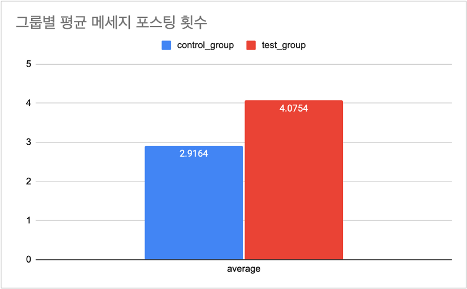</img>

 

[독립 2표본 t검정(양측꼬리) 실행]

- T-stat = -5.5266

- P-value = 0.0000

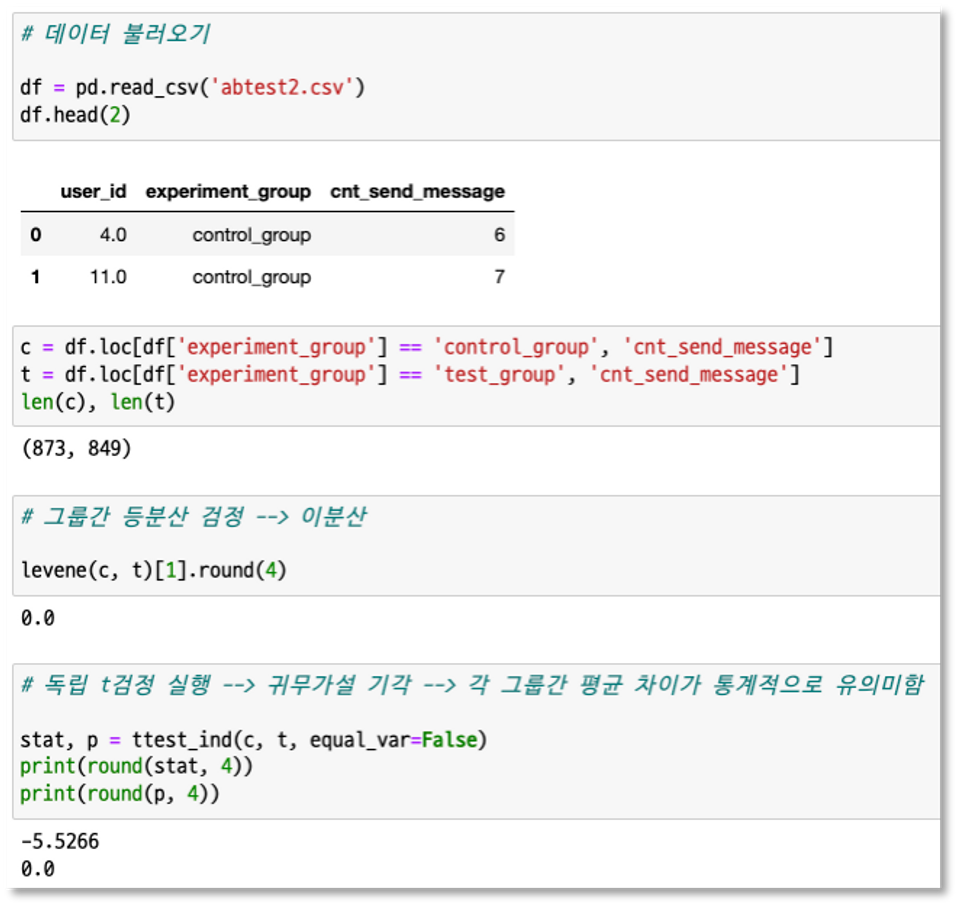</img>

 

 

# 💡 분석 결과

### 신규가입자가 모두 control group에 배정되는 샘플링 오류가 있었음

### 신규가입자를 제외하고 실험 재진행 → test group의 메시지 포스팅 횟수가 더 높음
